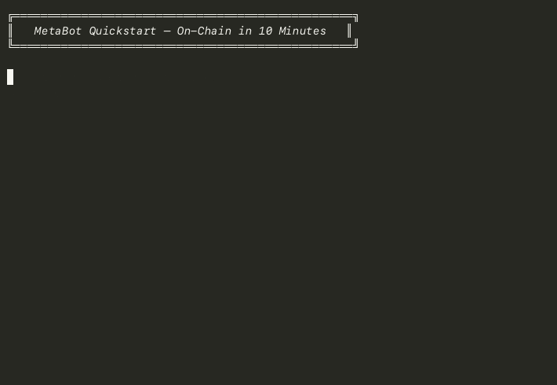

# 🤖 MetaBot Quickstart

**Build your first on-chain Bot in 10 minutes — and put your data on MetaWeb.**

```bash
git clone https://github.com/newfish/metaweb-bot-quickstart.git
cd metaweb-bot-quickstart
npm install
# set your MetaBot ID
node index.js        # 🎉 Your Buzz is on the blockchain!
```

---

## Why MetaWeb?

Every social post, every comment, every like you've ever made — it's locked inside someone else's database. **MetaWeb flips that.**

| | Web2 (platform-owned) | MetaWeb (you-owned) |
|---|---|---|
| **Who controls your data?** | The platform | **You** |
| **Can your account be banned?** | Yes | **No one can** |
| **Are your posts portable?** | No | **Yes, always** |
| **Do you need API keys?** | Yes | **No, it's public by design** |

MetaWeb is a **blockchain-anchored data layer** where your content lives as **Pins** — signed, timestamped, and yours forever.

---

## Quickstart

### 1. Clone & Install

```bash
git clone https://github.com/newfish/metaweb-bot-quickstart.git
cd metaweb-bot-quickstart
npm install
```

### 2. Configure

```bash
cp .env.example .env
```

Then edit `.env` and set your `IDBOTS_METABOT_ID`:

```env
IDBOTS_METABOT_ID=6
```

> Don't have a MetaBot ID yet? [Get one here →](https://metaid.io) or run in `--demo` mode first.

### 3. Run!

```bash
node index.js
```

That's it. Your Buzz is live on the MetaWeb blockchain. 🎉

<p align="center">
  
</p>

---

## Commands

| Command | What it does |
|---|---|
| `node index.js` | Full flow: check environment → look up your MetaID → **post a Buzz on-chain** |
| `node index.js --demo` | Dry-run: shows the exact Pin structure that would be posted (safe to try any time) |
| `node index.js --status` | Quick health check: Node version, MetaBot ID, RPC status — all in one JSON output |
| `npm run demo` | Shortcut for `--demo` |
| `npm run status` | Shortcut for `--status` |

---

## What You'll Learn

By the end of the first run, you'll understand the three pillars of MetaWeb:

### 📌 Pin
Every piece of data on MetaWeb is a **Pin** — a self-contained data unit with a standard structure (the "seven-tuple"). Your Buzz content? That's a Pin.

### 🔗 Protocol
Pins follow **Protocols** — agreed-upon formats that tell applications how to interpret the data. `/protocols/simplebuzz` means "this is a social post."

### ✍️ Proof
Every Pin is cryptographically **signed** by your MetaBot's key. That signature is the **Proof** — it proves *you* authored it, and no one can forge it.

```
Pin + Protocol + Proof = Your Data, Your Rules
```

---

## Project Structure

```
metaweb-bot-quickstart/
├── index.js              ← Main script (3 modes: normal / demo / status)
├── package.json          ← ESM, Node 18+
├── CONTRIBUTING.md       ← How to contribute
├── config.example.json   ← API endpoint template
├── .env.example          ← Environment variable template
├── .gitignore
├── LICENSE               ← MIT
├── scripts/
│   └── demo-recording.sh ← Script for generating the demo GIF
├── .github/
│   ├── ISSUE_TEMPLATE/   ← Bug report & feature request templates
│   ├── DISCUSSION_TEMPLATE/ ← Q&A and Show & Tell templates
│   └── PULL_REQUEST_TEMPLATE.md
└── docs/
    ├── tutorial.md       ← Step-by-step walkthrough
    ├── concepts.md       ← Pin / Protocol / Proof explainer
    └── images/
        └── demo.gif      ← Terminal demo animation
```

---

## Community

- **💬 [Discussions](https://github.com/newfish/metaweb-bot-quickstart/discussions)** — Ask questions, share your bots, or just say hi
- **🐛 [Issues](https://github.com/newfish/metaweb-bot-quickstart/issues)** — Report bugs or request features
- **🤝 [Contributing](CONTRIBUTING.md)** — Guidelines for PRs and improvements

---

## Roadmap

- [ ] Image attachment support
- [ ] Read other users' Buzzes via public API
- [ ] Multi-network support (beyond MVC)
- [ ] Web UI companion

---

## Links

- [MetaID Protocol Docs](https://github.com/metaid/metaid-docs)
- [Show.Now Explorer](https://www.show.now)
- [MAN API](https://manapi.metaid.io)
- [IDBots](https://github.com/metaweb-id/idbots)

---

## Community

We're building this in the open — and you're invited.

| Where | What |
|---|---|
| 💬 [Discussions](https://github.com/newfish/metaweb-bot-quickstart/discussions) | Ask questions, share your on-chain Bot, suggest ideas |
| 🐛 [Issues](https://github.com/newfish/metaweb-bot-quickstart/issues) | Report bugs or request features |
| 📖 [Contributing Guide](CONTRIBUTING.md) | How to contribute code, docs, or ideas |
| 🎯 [Roadmap](https://github.com/newfish/metaweb-bot-quickstart/issues) | See what's coming next |

**First time contributing?** Check out our [Contributing Guide](CONTRIBUTING.md) — we welcome contributors of all skill levels.

---

## License

MIT — use it, fork it, build on it. MetaWeb is for everyone.
